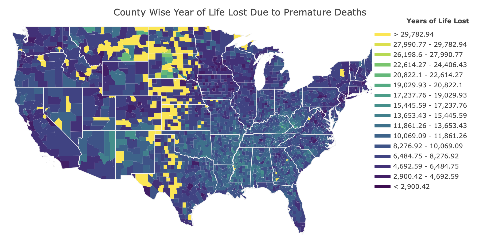

# Reducing Premature Deaths in US

# Executive Summary:
We are consultants hired by US-Health and Human Services to identify the reasons of High Premature deaths in some of the counties. We used the 'County Health Rankings and Roadmaps' data colllected by Robert Wood Johnson Foundation and the University of Wisconsin.

## Data Understanding:
We chose 34 independent variables and with refinement ended up with 14 variables. Those are as follows:
* **Physically Unhealthy Days: Average number of reported physically unhealthy days per month**
* **% LBW: Percentage of births with low birth weight (<2500g)**
* **% Obese: Percentage of adults that report BMI >= 30**
* **Food Environment Index: Indicator of access to healthy foods - 0 is worst, 10 is best**
* **% Physically Inactive: Percentage of adults that report no leisure-time physical activity**
* **Chlamydia Rate: Chlamydia cases per 100,000 population**
* **Teen Birth Rate: Births per 1,000 females ages 15-19**
* **Preventable Hosp. Rate: Discharges for Ambulatory Care Sensitive Conditions per 100,000 Medicare Enrollees**
* **Income Ratio: Ratio of household income at the 80th percentile to income at the 20th percentile**
* **% Single-Parent Households: Number of children that live in single-parent households**
* **Injury Death Rate: Injury mortality rate per 100,000**
* **Average Daily PM2.5: Average daily amount of fine particulate matter in micrograms per cubic meter**
* **% Drive Alone: Percentage of workers who drive alone to work**
* **% Long Commute - Drives Alone: Among workers who commute in their car alone, the percentage that commute more than 30 minutes**

Our target variable was **Years of Potential Life Lost Rate**, which is the Age-adjusted Years of Potential Life Lost rate per 100,000 i.e. cummulative sum of ages of individuals died before achieving life expectancy of 78.69 years.

## Data Preparation:
1. **Data import**  
    - Used worksheet- 'Ranked Measure Data' and used 34 relevant indicators
  
2. **Exploratory Data and data cleansing**  
    - Using Data Visualisation found out that states of Montana, North Dakota, South Dakota, Nebraska, Kansas, Okhlahoma and Texas have high years of life lost.
    - Removed rows with missing data

## Modelling:
    - Base Model: R-squared value of 0.849 using cross validation on train data for the base model
    - Interactions: Evaluated model by adding interactions. Result: no interaction found.
    - Multicolliniarity: Removed columns with high multicolliniarity (>0.75)
    - Model refinement: Refined model to R-sqaured value of 0.853
    - p-values: Removed columns with high p-values (>0.05), meaning those columns didn't have significant impact on outcome and were there by chance.
    - Model refinement: Refined model to R-sqaured value of 0.851 and just 14 independent variables from initial nummber of 34
    - Normality check: Overall, the residuals followed the normality, although there are some violations after 2 standard deviations
    - Homoscedasticity check: Overall, the residuals followed the homoscedasticity, although there are some violations due to presence of outliers in training dataset

## Evaluation:
    - Evaluated the final coefficients using Linear Regression cross validation, Ridge Regression cross validation and Lasso Regression cross validation.
    - Final model chosen: Lasso Regression with penalty factor - 0.1
    - Test Data Results: R-squared value of 0.822 which means that test predictions are in line with training set results.

## Key Findings and conclusion:

1. **Top 3 factors responsible for premature deaths**
    - The model suggests that Injury Death Rate, Teen Birth Rate and Percent Physically Inactive are 3 biggest contributor of premature deaths.
  
2. **Recommendations**
    - Reduce Injury Death Rates: Government should focus on reducing Injury mortality rate per 100,000. Key to achieving this is to devise policies that result in lower accidents.
    - Teen Birth Rate: Government should focus on reducing the teen birth rate (Births per 1,000 females ages 15-19) as the females in this age might not be able to provide proper care to the child that results in premature death.
    - Physical Activity: Focus should be on to motivate people and create an environment that stimulates physical activity.